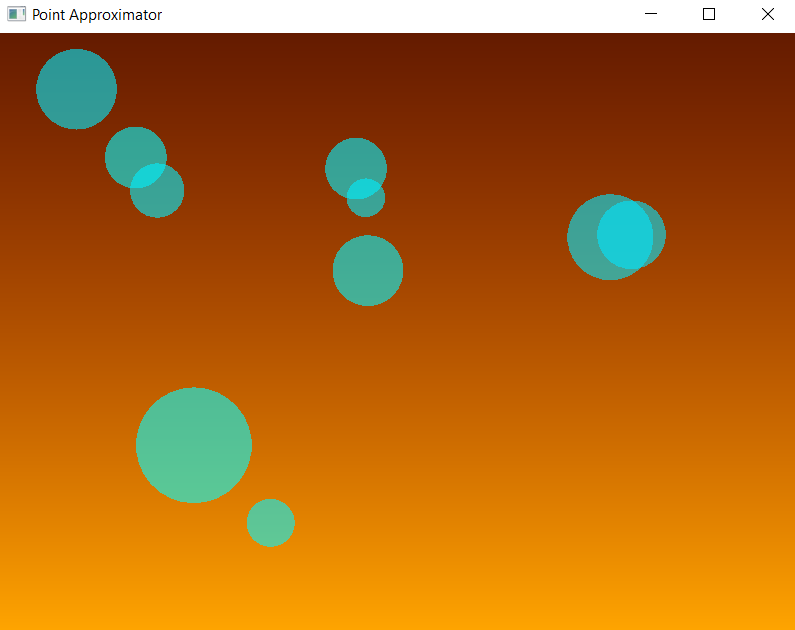
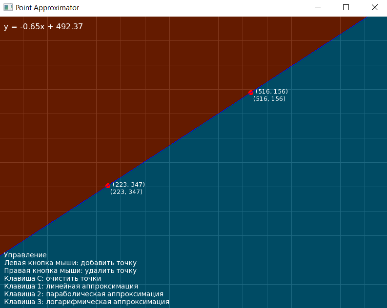
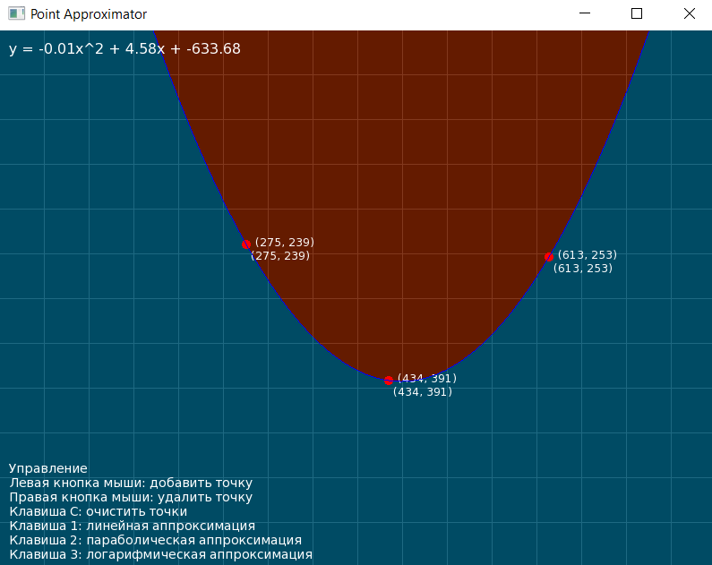
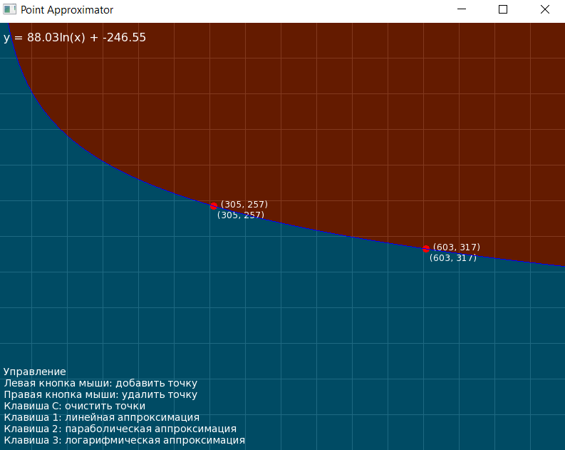

[](https://github.com/yourusername/PointApproximator)
[](https://en.wikipedia.org/wiki/C%2B%2B)
[](https://www.sfml-dev.org/)
# Point Approximator

**Point Approximator** — это приложение для аппроксимации точек с использованием линейной, параболической и логарифмической функций. Оно также включает визуальный эффект "лавовой лампы", который отображается, если на экране нет точек.

## Оглавление

- [Возможности](#возможности)
- [Назначение](#назначение)
- [Как это работает](#как-это-работает)
- [Управление](#управление)
- [Требования](#требования)
- [Структура проекта](#структура-проекта)
- [Сборка и запуск](#сборка-и-запуск)
- [Примечания](#примечания)
- [Примеры использования](#примеры-использования)
- [Зависимости](#зависимости)
---

##Возможности

1. Добавление и удаление точек:
   - Левый клик мыши: добавить точку.
   - Правый клик мыши: удалить точку.

2. Типы аппроксимации:
   - Линейная: y = ax + b.
   - Параболическая: y = ax^2 + bx + c.
   - Логарифмическая: y = a*ln(x) + b.

3. Возможности окна:
   - Изменение размера окна с автоматической адаптацией содержимого.
   - Отображение уравнения текущей аппроксимации.
   - Сетка, адаптирующаяся к размерам окна.

4. Эффект лавовой лампы:
   - При отсутствии точек экран наполняется анимацией "жидкости", напоминающей лавовую лампу.

---

##Назначение

**Point Approximator** — это инструмент для демонстрации и изучения методов аппроксимации. 

---

##Как это работает

1. Пользователь добавляет точки на экран с помощью мыши.
2. Приложение вычисляет параметры аппроксимации и отображает соответствующую линию.
3. На экране выводится уравнение аппроксимации с рассчитанными коэффициентами.
4. Сетка и элементы интерфейса адаптируются к изменению размеров окна.

---

## Управление

**Клавиши:**
1. 1 — Переключение на линейную аппроксимацию.
2. 2 — Переключение на параболическую аппроксимацию.
3. 3 — Переключение на логарифмическую аппроксимацию.
4. C — Очистка всех точек.

**Мышь:**
1. Левый клик: добавить точку.
2. Правый клик: удалить точку.

---

##Требования

1. Компилятор: MinGW (поддержка C++17).
2. CMake: Версия 3.17.5 или выше.
3. SFML: Библиотека SFML автоматически загружается через CMake FetchContent.
4. Git: Для клонирования репозитория.

---

## Структура проекта

**Директории:**
- src/app — Основной класс приложения.
- src/grid — Логика и отрисовка сетки.
- src/point — Логика точек и аппроксимации.
- src/lavalamp — Реализация эффекта лавовой лампы.

**Файлы:**
- main.cpp — Точка входа в приложение.
- CMakeLists.txt — Настройки сборки.

---

# Сборка и запуск

### 1. Клонирование репозитория
```bash
git clone https://github.com/suraifokkusu/PointApproximator.git
cd PointApproximator
```

### 2. Создание директории сборки
```bash
mkdir build
cd build
```

### 3. Запуск CMake
```bash
cmake .. -G "MinGW Makefiles"
```

### 4. Сборка проекта
```bash
mingw32-make
```

### 5. Запуск приложения
```bash
cd bin
./main.exe
```

---

## Примечания

1. Убедитесь, что файл шрифта DejaVuSans.ttf находится в директории bin рядом с исполняемым файлом. Если его нет, замените путь в коде на доступный шрифт.
2. При использовании MinGW убедитесь, что путь к mingw32-make добавлен в переменную окружения PATH.

---

##Примеры использования


*Рисунок 1: Главный экран приложения.*


*Рисунок 2: Пример линейной аппроксимации.*


*Рисунок 3: Пример параболической аппроксимации.*


*Рисунок 4: Пример логарифмической аппроксимации.*

---

## Зависимости

1. SFML: Simple and Fast Multimedia Library (https://www.sfml-dev.org/)
2. CMake: Кроссплатформенная система сборки (https://cmake.org/)
3. MinGW: Компилятор для Windows (http://www.mingw.org/)

---

